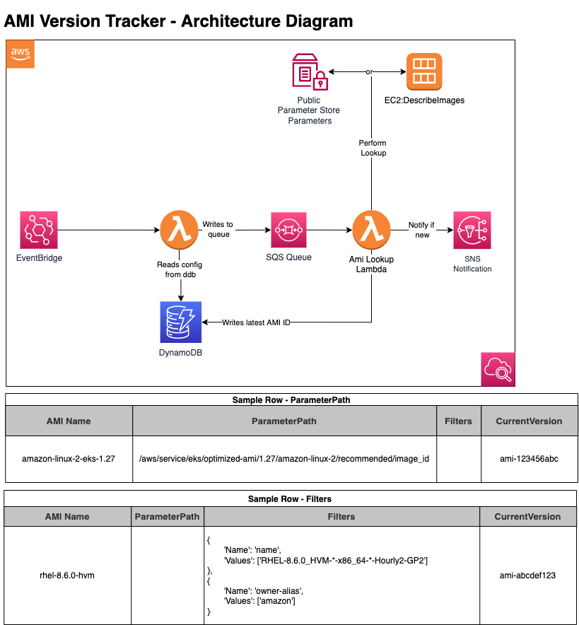

# Amazon Machine Image Version Tracker

## Purpose

Once deployed to your [Amazon Web Services](https://aws.amazon.com) Account, the resources and associated yaml configuration in this terraform module can be used to track and alert on new versions of AWS and third-party Amazon Machine Images.  This allows for eventing on AMI releases, so you can run a build / configuration processes or act to upgrade your development environment when new upstream AMIs are released.

For example, this project can serve to fill the gap in notifications of new EKS optimized AMIs as requested here: https://github.com/aws/containers-roadmap/issues/734

**Technology stack**: Python, Terraform, AWS Resources: Lambda, Dynamodb, SQS, SNS, and CloudWatch.  See architecture diagram below for more information.

## Prerequisites

An [Amazon Web Services](https://aws.amazon.com) Account and some basic knowledge of how [Terraform Modules](https://developer.hashicorp.com/terraform/language/modules) work are required to get started with this project.

## Deploying to your AWS Account

Please see the [INSTALL](INSTALL.md) document for more information.

## Configuring a tracked image

To track upstream AMI versions, simply add a yaml file to the `tracked_images` folder.  There are two configuration types available, Parameter and Filter.

### Parameter

The current version of many Amazon and third-party AMIs can be found in public Parameter Store parameters.  Some examples can be found [here](https://docs.aws.amazon.com/eks/latest/userguide/retrieve-ami-id.html), and a guide to finding public parameters can be found [here](https://docs.aws.amazon.com/systems-manager/latest/userguide/parameter-store-finding-public-parameters.html).  The configuration for tracking an AMI with a public parameter requires 2 fields, Name and ParameterPath.  It should look similar to the below. 

```yaml
images:
  - Name: al2-eks-1.27
    ParameterPath: "/aws/service/eks/optimized-ami/1.27/amazon-linux-2/recommended/image_id"
  - Name: al2-eks-1.27-arm
    ParameterPath: "/aws/service/eks/optimized-ami/1.27/amazon-linux-2-arm64/recommended/image_id"
```

### Filter

A filter is required to obtain the version for any AMI that does not have a public Parameter Store parameter.  Required fields for this type of configuration include Name and Filter.  The Filter field is configured as a list of maps and this field is fed to an ec2 `describe_images` API call.  The latest image is found by performing the filter call, sorting the results by creation date, and selecting the newest entry.  Documentation for the EC2 `describe_images` call can be found [here](https://boto3.amazonaws.com/v1/documentation/api/latest/reference/services/ec2/client/describe_images.html).  Sample configuration can be found below.  You can test your filters by calling `ec2 describe_images` in the AWS CLI.  Example: `aws ec2 describe-images --filters "Name=name,Values=RHEL-8.6.0_HVM-*-x86_64-*-Hourly2-GP2" "Name=owner-alias,Values=amazon"`.

```yaml
---
images:
  - Name: redhat-8.6.0-hvm
    Filters: >-
      {
        'Name': 'name',
        'Values': ['RHEL-8.6.0_HVM-*-x86_64-*-Hourly2-GP2']
      },
      {
        'Name': 'owner-alias',
        'Values': ['amazon'] 
      }
```

## Solution Architecture 

The solution consists of a DynamoDB table, 2 Lambda functions, an SQS queue, and an SNS Notification.  The process is kicked off via EventBridge "cron" type trigger. Filter or Parameter information is stored in the DynamoDB table.  Upon trigger, the queuer function sends all lookup data to SQS.  The Lookup Lambda reads the SQS Queue and processes each record by querying for the latest version of the specified AMI.  If there is a new version (defined by an updated AMI version ID), a notification is sent via SNS.



## Sample Event

```json
---
"v1": {
  "Message": "A new version of the amazon-linux-2-eks-1.27 has been released. You are now able to launch new EC2 instances from these AMIs.",
  "image":  {
      "image_name": "amazon-linux-2-eks-1.27",
      "image_id": "ami-123456abcdef789"
  },
  "region": "us-east-1"
}

```